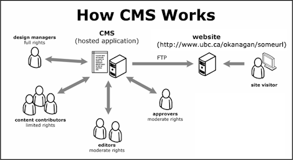

# Introduction aux CMS

> Un système de gestion de contenu ou SGC (_content management system_ ou CMS en
> anglais) est un programme informatique permettant de créer un site internet,
> un blogue ou encore un site de vente en ligne. Les fonctionnalités d'un SGC
> sont nombreuses. Il permet entre autres de travailler à plusieurs sur un même
> document ; de séparer les opérations de gestion de la forme et du contenu ; de
> structurer le contenu (FAQ, documents, blogues, forums, etc.) ; de
> hiérarchiser les utilisateurs et de leur attribuer des permissions (anonyme,
> administrateur, contributeur, etc.). Il fournit également une chaîne de
> publication (_workflow_) offrant par exemple la possibilité de mettre en ligne
> le contenu des documents. Certains SGC incluent la gestion des versions.
>
> [Wikipedia](https://fr.wikipedia.org/wiki/Système_de_gestion_de_contenu)

## Fonctions communes

-   Utilisation d'interface Web
-   Séparation entre contenu et présentation
-   Édition de page simplifiée
-   Gestion des droits

## Types de CMS

-   Couplé ou traditionnel (_coupled_)
-   SaaS (_software as a service_)
-   Découplé (_decoupled_)
-   Sans tête (_headless_)

## Quelques exemples

-   [Wordpress](https://wordpress.org)
-   [Ghost](https://ghost.org)
-   [Drupal](https://www.drupal.org)
-   [Sanity](https://www.sanity.io)
-   [Strapi](https://strapi.io/)
-   [Craft](https://craftcms.com)
-   [Joomla](https://www.joomla.org)
-   [Kirby](https://getkirby.com)
-   [Wix](https://www.wix.com)
-   [Squarespace](https://www.squarespace.com)
-   [Cargo](https://cargo.site)

## Ressources

-   https://fr.wikipedia.org/wiki/Système_de_gestion_de_contenu
-   https://www.oracle.com/ca-en/content-management/what-is-cms/
